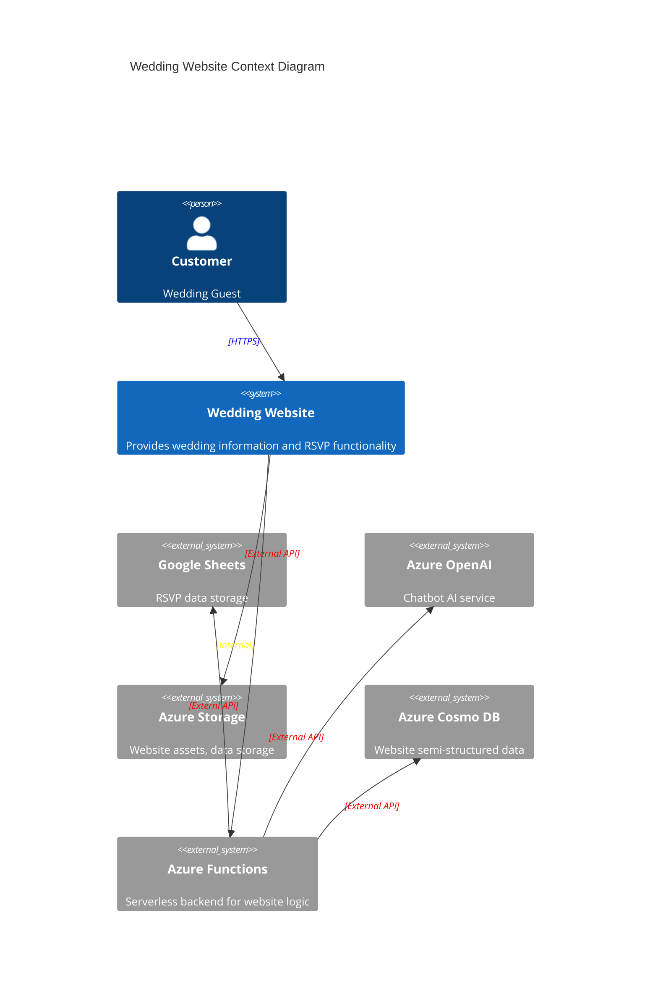
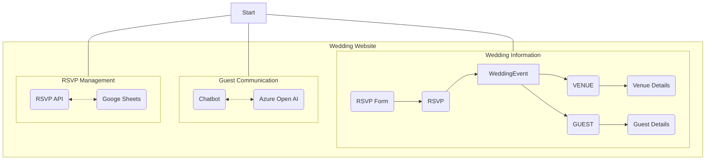
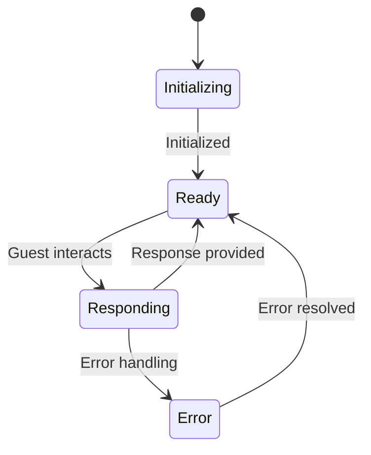

<!--
  Sources:
  https://learn.microsoft.com/en-us/archive/msdn-magazine/2009/february/best-practice-an-introduction-to-domain-driven-design
  https://en.wikipedia.org/wiki/Domain-driven_design
  https://www.domainlanguage.com/
  https://medium.com/yanchware/domain-driven-design-a-cheat-sheet-722a4e4f9c7f
  https://www.domainlanguage.com/wp-content/uploads/2016/05/DDD_Reference_2015-03.pdf
-->

<h1 align="center"><a href="https://langston-wedding.com/">langston-wedding.com 💒</a></h1>
<p align="center">
    This project aims to build a modern wedding website using Domain-Driven Design (DDD) principles. <br/><u>🚧 Currently under construction. 🚧</u>
</p>

<p align="center">
  <a href="https://github.com/dylanlangston/langston-wedding.com/actions/workflows/test.yml"></a>
  <a href="https://github.com/dylanlangston/dylanlangston/blob/master/LICENSE"></a>
  <a href="https://api.github.com/repos/dylanlangston/langston-wedding.com"></a>
</p>

<details> 
  <summary>What is <b>Domain-Driven Design? ...</b></summary>
  <p align="center">Domain-Driven Design (DDD) is a software development approach that emphasizes understanding and modeling the core business domain, ensuring that the software accurately reflects the real-world concepts and logic. Instead of focusing solely on technical concerns, DDD prioritizes aligning the software's design with the business domain, leading to a more maintainable, flexible, and understandable codebase.</p> 
  <p align="center"><strong>While DDD is typically recommended for larger, complex projects with multiple teams and stakeholders, this project serves as a personal learning exercise and a fun application of DDD concepts in a real-world scenario.</strong></p>
</details>

<hr/>

## Project Overview 🎉

This wedding website aims to provide a seamless and interactive experience for guests, encompassing features such as:

- **RSVP Page 📅:** Guests can RSVP via an API integrated with Google Sheets.
- **About Us 💑:** Detailed information about the couple and their story.
- **Wedding Party 👰🤵:** Introductions and pictures of the wedding party.
- **Guest Accommodations 🛌:** Links and information about hotels and lodging options.
- **Venue 📍:** Venue address, timings, and map integration.
- **Contact Information 📞:** Easy access to contact details for the couple.
- **Gift Registry 🎁:** Links to gift registry services.
- **Post-Wedding 🎉:** Thank you message, photo gallery, and video links.
- **Chatbot 🤖:** An AI-powered chatbot (using Azure OpenAI) to answer guest questions about various aspects of the wedding.

*Mantra: The tendecy towards perfectionism underminds attempts to do good design.*

## Implementation Details ⚙️

- **Frontend 🎨:** [React](https://react.dev/) with [MUI - Material UI](https://mui.com/material-ui/). This choice leverages the popularity and component-based structure of React, combined with the aesthetic and accessibility benefits of Material Design. 
- **Backend ☁️:** Serverless architecture on [Azure](https://azure.microsoft.com/en-us), using Azure Functions for their event-driven nature, scalability, and cost-effectiveness.
- **Database 📈:** [Google Sheets](https://www.google.com/sheets/about/) will store RSVP data due to its ease of use and integration capabilities, allowing for quick setup and data management. Other website data might be stored in [Cosmos DB](https://azure.microsoft.com/en-us/products/cosmos-db/), taking advantage of its scalability and integration with the Azure ecosystem.
- **CI/CD 🚀:** [GitHub Actions](https://github.com/features/actions) will automate the build, testing, and deployment processes, streamlining the development workflow and ensuring code quality.
- **Chatbot 🤖:** [Azure OpenAI](https://azure.microsoft.com/en-us/products/ai-services/openai-service), with its advanced natural language processing capabilities, will power the chatbot functionality, providing guests with intelligent and relevant responses to their queries.

## DDD in Action 🛠️

This project uses DDD to structure the codebase, enhance maintainability, and align the software design with the business logic of a wedding website. Below are the core DDD concepts being implemented:

<table>
  <tr>
    <td>
      <details>
        <summary><h4>Distillation: Finding the Core Domain 🌟</h4></summary>
        <p>The core domain of this project is the <b>Wedding Event 💍</b>. This is because every feature and piece of functionality revolves around providing information about this event, managing guest interactions related to it, and ultimately, celebrating the big day. </p>
        <p>For instance, the RSVP system exists to track who will be attending the Wedding Event. The Venue information is crucial for guests to locate the Wedding Event. Even the Chatbot, which exists as a supporting subdomain, is there to answer questions and provide information directly related to the Wedding Event. </p>
        <p>By identifying the Wedding Event as the core domain, we can prioritize our development efforts and ensure that our software model accurately reflects the essential aspects of a real-world wedding. Other features, like the chatbot, photo gallery, or guest accommodation links, are supporting subdomains. They enhance the user experience but are not central to the core domain.</p>
      </details>
    </td>
  </tr>
  <tr>
    <td>
      <details>
        <summary><h4>Bounded Contexts 📏</h4></summary>
        <p>To manage complexity and maintain a clear separation of concerns, we'll create distinct bounded contexts. Each bounded context represents a specific area of the application with its own domain model, ensuring that changes within one context have minimal impact on others.</p>
        <p>Here are examples of bounded contexts within our wedding website:</p>
        <ul>
          <li><b>Wedding Information 📝:</b> This context focuses on managing the core details of the Wedding Event. This includes information like the date and time of the wedding, the location of the ceremony and reception, and any other essential details guests need to know. The Wedding Event Aggregate will likely reside within this bounded context.</li>
          <li><b>RSVP Management 📅:</b> This context is responsible for handling everything related to RSVPs. It manages the API integration with Google Sheets, processes guest responses, and stores the RSVP data securely. The RSVP service, responsible for interacting with the Google Sheets API, would belong here, as would the Guest Aggregate, which would store information about each guest and their RSVP status.</li>
          <li><b>Guest Communication 📧:</b> This context centers around communication with guests. This includes the chatbot functionality, which provides instant answers to guest queries, as well as potential features like email notifications about wedding updates. The Chatbot Service, responsible for processing chatbot interactions, would be part of this bounded context. </li>
        </ul>
      </details>
    </td>
  </tr>
  <tr>
    <td>
      <details>
        <summary><h4>Ubiquitous Language 🗣️</h4></summary>
        <p>Aligning our language between developers and domain experts (in this case, those involved in planning the wedding) is crucial for DDD's success. We'll establish a ubiquitous language to ensure everyone uses the same terminology when discussing the project, from design meetings to code comments. </p>
        <p>For example, instead of using technical jargon like "database record" or "API endpoint," we'll use terms like "Guest," "RSVP," and "Wedding Event," reflecting the language used in the wedding planning domain. This shared vocabulary reduces misunderstandings and makes the codebase more accessible and easier to maintain. Here's how our ubiquitous language looks in practice: <a href="./UbiquitousLanguage.md"><code>./UbiquitousLanguage.md</code></a></p>
      </details>
    </td>
  </tr>
  <tr>
    <td>
      <details>
        <summary><h4>Aggregates 📚</h4></summary>
        <p>Aggregates help us manage data consistency and integrity by grouping related objects. Within our wedding website, we'll define aggregates to encapsulate related data and ensure that operations on this data happen in a controlled manner. </p>
        <p>Here are two primary aggregates we'll implement:</p>
        <ul>
          <li><b>Wedding Event Aggregate 💍:</b> This aggregate, likely residing within the "Wedding Information" bounded context, acts as the central point for all core wedding details. It includes information about the Wedding Event itself, such as the date, time, venue, and potentially a description. This aggregate also encapsulates the RSVP data, as RSVPs are directly related to the Wedding Event. It ensures that all updates and changes to the Wedding Event and its associated RSVPs happen consistently.</li>
          <li><b>Guest Aggregate 👤:</b> Belonging to the "RSVP Management" bounded context, this aggregate represents a single guest and their associated information. It stores the guest's name, contact details, any dietary restrictions or special requests they might have, and their RSVP status. By encapsulating this data, the Guest Aggregate makes it easier to manage individual guest information and ensures that any changes, like updating a guest's contact information or RSVP status, happen atomically. </li>
        </ul>
      </details>
    </td>
  </tr>
  <tr>
    <td>
      <details>
        <summary><h4>Entities and Value Objects ⚖️</h4></summary>
        <p>Distinguishing between entities and value objects allows us to model our domain more accurately. Entities have a unique identity and a lifecycle, meaning they can change over time but are still recognizable as the same entity. Value objects, on the other hand, are defined by their attributes and are considered immutable—once created, their values don't change.</p>
        <p>Here's how we'll apply entities and value objects:</p>
        <ul>
          <li><b>Entities 👤:</b></li>
          <ul>
            <li><b>Guest:</b> A Guest is an entity because they have a unique identity. Even if their contact information changes, they're still the same guest. </li>
            <li><b>Wedding Event:</b> The wedding event has a unique identity too.</li>
            <li><b>Venue:</b> The venue also has a unique identity. </li>
          </ul>
          <li><b>Value Objects 🔧:</b> </li>
          <ul>
            <li><b>Wedding Date:</b>  The wedding date is a value object—it's a specific point in time and doesn't change.</li>
            <li><b>Venue Address:</b> The address is also a value object, representing a specific location. </li>
          </ul>
        </ul>
      </details>
    </td>
  </tr>
  <tr>
    <td>
      <details>
        <summary><h4>Services 🛠️</h4></summary>
        <p>Services help us encapsulate business logic that doesn't naturally fit within entities or value objects. They typically represent actions or operations within our domain. </p>
        <p>Here are some examples of services we'll use:</p>
        <ul>
          <li><b>Chatbot Service 🤖:</b>  This service handles all interactions with the Azure OpenAI API. It takes a guest's query as input, processes it, gets a response from the AI model, and delivers the response back to the user. </li>
          <li><b>RSVP Service 📅:</b> This service manages the interaction with our Google Sheets database. It handles tasks like adding new RSVPs, updating existing ones, and retrieving RSVP data for display on the website.</li>
        </ul>
      </details>
    </td>
  </tr>
</table>

## Project Structure 🏗️

This project will follow a modular structure aligned with the principles of DDD. This approach enhances code organization and maintainability, making it easier to navigate and understand different parts of the application.

We'll have separate modules or directories for each bounded context:

- **`wedding-information`:** Containing all components related to managing and displaying core wedding details, including the Wedding Event Aggregate and related entities and value objects.
- **`rsvp-management`:** Housing the logic for RSVP processing, the Google Sheets API integration, and the Guest Aggregate.
- **`guest-communication`:** Containing the Chatbot Service and any other components related to guest interaction, like potential email notification services.

This structure promotes a clear separation of concerns. Each module focuses on a specific aspect of the domain, minimizing dependencies between modules and making it easier to make changes and add features without impacting other parts of the application.

## Models 📊
<!-- 
  MermaidJS docs: https://mermaid.js.org/syntax/flowchart.html 
  Great resource that shows the different model types: https://www.dandoescode.com/blog/plantuml-vs-mermaid
-->
Visual models help us understand the project's structure and the relationships between different components. Here are some key models for this wedding website:

#### C4 Context Diagram: High-Level System Relationships
This diagram provides a high-level view of the wedding website's architecture and its interactions with external systems.



#### Entity Relationship Diagram: Core Domain Data Structure
The ER diagram visualizes the core entities of our domain and their relationships. It helps understand how we store and structure data.

```mermaid
erDiagram
    RSVP }|--|| WEDDING_EVENT : contains
    WEDDING_EVENT ||--|{ VENUE : has
    WEDDING_EVENT ||--|{ GUEST : has
    RSVP {
        GUEST guest
        boolean attending
        string? plusOne
        string? dietaryRestrictions
        string? comment
        RSVPStatus rsvpStatus
    }
    VENUE {
        UUID id
        string name
        string address
        string link
    }
    GUEST {
        UUID id
        string name
        string email
        string? phoneNumber
        Address? address
    }
    WEDDING_EVENT {
        UUID id
        string title
        string description
        date date
        string website
    }
```

#### Flowchart: Website Workflows and Interactions
The flowchart illustrates the primary workflows within the wedding website, showing how data flows between different components.



#### State Diagram: Lifecycle of Chatbot Interactions
This state diagram visualizes the different states the chatbot can be in and how it transitions between those states based on guest interactions. 



## Design Mockups 🖼️
For a visual representation of the website's design and layout, please refer to the [Mockups](./Mockups.md) Document.

## Challenges and Considerations 🤔

While DDD offers numerous benefits, applying it to a relatively simple project like this wedding website comes with some considerations:
* **Overhead vs. Simplicity:**  DDD introduces a certain level of overhead in terms of upfront design and planning. It's crucial to balance the benefits of DDD with the potential complexity it might add to a small project. 
* **Learning Curve:** DDD has a learning curve, especially for those unfamiliar with its principles and patterns. It requires a shift in thinking about software design, focusing on the domain logic rather than technical implementation.

## Dev Environment 💻
<table>
  <tr>
    <td colspan="6">
      This repository offers a streamlined development environment setup using a <a href=".devcontainer/devcontainer.json"><code>devcontainer.json</code></a> file, allowing you to get up and running quickly with a fully-featured environment in the cloud.<sup><a href="#local-development" id="fnref-local-development">[1]</a></sup> Use one of the following links to get started:
    </td>
  </tr>
  <tr>
    <td colspan="2">
      <p align="center">
        <a href="https://codespaces.new/dylanlangston/langston-wedding.com"></a>
      </p>
    </td>
    <td colspan="2">
      <p align="center">
        <a href="https://vscode.dev/redirect?url=vscode://ms-vscode-remote.remote-containers/cloneInVolume?url=https://github.com/dylanlangston/langston-wedding.com"></a>
      </p>
    </td>
    <td colspan="2">
      <p align="center">
        <a href="https://devpod.sh/open#https://github.com/dylanlangston/langston-wedding.com"></a>
      </p>
    </td>
  </tr>
  <tr>
    <td colspan="6">
      If you want to browse the source code without the need to build, you can do so conveniently on GitHub.dev or VSCode.dev:
    </td>
  </tr>
  <tr>
    <td colspan="3">
      <p align="center">
        <a href="https://github.dev/dylanlangston/langston-wedding.com"></a>
      </p>
    </td>
    <td colspan="3">
      <p align="center">
        <a href="https://vscode.dev/github/dylanlangston/langston-wedding.com"></a>
      </p>
    </td>
  </tr>
</table>
</p>

## License 📜
This repo is licensed under the [MIT License](https://opensource.org/licenses/MIT). See the [`LICENSE`](LICENSE) file for details.

<h2 id="footer"></h2>
<sub>
<section>
  <ol dir="auto">
    <li id="local-development">
    <p>For local development check out <a href="https://marketplace.visualstudio.com/items?itemName=ms-vscode-remote.remote-containers">Dev Containers</a> and <a href="https://devpod.sh/">DevPod</a>. <a href="#fnref-local-development" aria-label="Back to reference 1">↩</a></p>
    </li>
  </ol>
</section>
</sub>